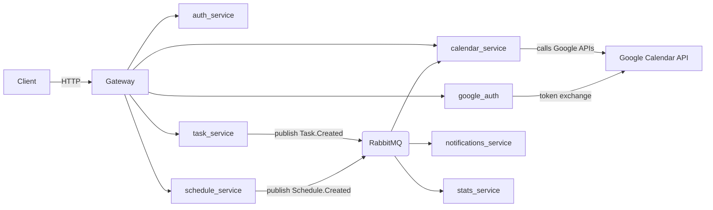

# Arquitectura

Arquitectura basada en microservicios con comunicación asíncrona por eventos (RabbitMQ) y un API Gateway como único punto de entrada exterior.

Componentes principales:

- API Gateway: proxy y punto único de entrada (expone puerto 8000 al host).
- auth_service: gestión de usuarios y JWT.
- google_auth: flujo OAuth2 / OpenID Connect con Google.
- calendar_service: integración con Google Calendar y sincronización al consumir eventos.
- googlefit_service: acceso a Google Fit (lecturas/metrics).
- task_service: CRUD de tareas y publicación de eventos de dominio.
- schedule_service: CRUD de bloques/horarios; publicación de eventos.
- notifications_service: consumidor de eventos y generación de notificaciones.
- stats_service: métricas y agregación de eventos.
- agent_service: servicio para recomendaciones (futuro/experimental).
- RabbitMQ: bus de eventos (exchange/queues por evento de dominio).

Diagrama (Mermaid):

Red de Docker: todos los servicios comparten una red interna (ej. `kairos-network`) y se resuelven por nombre de servicio.

Patrones aplicados:

- Event-driven architecture para desacoplar responsabilidades.
- API Gateway para centralizar seguridad, CORS y ruteo.
- Side-effect-safe design: los servicios publican eventos y los consumidores deciden la acción eventual.

## Flujo Clerk + Google + Kairos

1. El frontend inicia sesión con Clerk.
2. Clerk únicamente maneja la autenticación y la sesión del usuario.
3. El backend obtiene el `clerk_user_id` autenticado y llama a Clerk Backend API:
   `GET https://api.clerk.com/v1/users/{user_id}/oauth_access_tokens/google`
4. El backend recibe el `access_token` real de Google y lo usa internamente para Calendar y Fit.
5. El frontend no maneja ni almacena tokens de Google; todas las integraciones Google ocurren server-side.
