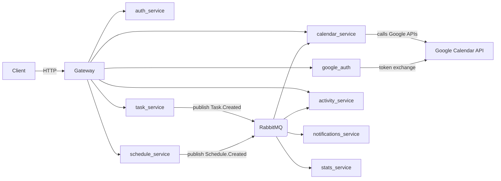

# Arquitectura

Resumen: este documento detalla la arquitectura global del sistema, incluyendo componentes, flujos de datos (síncronos y asíncronos), y el rol del API Gateway. Para contexto general, revisa el `README.md` en la raíz.

Arquitectura basada en microservicios con comunicación asíncrona por eventos (RabbitMQ) y un API Gateway como único punto de entrada exterior.

Componentes principales:

- API Gateway: proxy y punto único de entrada (expone puerto 8000 al host). Maneja verificación de tokens, decodifica tokens de terceros (p. ej. Clerk) y enruta a servicios internos.
- auth_service: gestión de usuarios y JWT (emisión de tokens Kairos, gestión de `clerk_id` y `handle`).
- google_auth: flujo OAuth2/OpenID Connect con Google y puente para solicitar sincronización a `auth_service`.
- calendar_service: integración con Google Calendar y sincronización al consumir eventos.
- googlefit_service: acceso a Google Fit (lecturas/metrics).
- activity_service, task_service, schedule_service, notifications_service, stats_service, agent_service.
 - activity_service: servicio encargado de construir el feed de actividad del usuario, agrupar y transformar eventos de dominio (tareas, schedules, logros), gestionar amistades/invitaciones y publicar eventos de actividad para consumo por UI o terceros.
 - task_service: CRUD de tareas y publicación de eventos de dominio.
 - schedule_service: CRUD de bloques/horarios y publicación de eventos.
 - notifications_service: consumidor de eventos que genera notificaciones para usuarios.
 - stats_service: agrega métricas y estadísticas a partir de eventos.
 - agent_service: servicios de recomendación y procesos experimentales.
- RabbitMQ: bus de eventos (exchange/queues por evento de dominio).

Diagrama (Mermaid):

Red de Docker: todos los servicios comparten una red interna (ej. `kairos-network`) y se resuelven por nombre de servicio.

Patrones aplicados:

- Event-driven architecture para desacoplar responsabilidades.
- API Gateway para centralizar seguridad, CORS y ruteo.
- Side-effect-safe design: los servicios publican eventos y los consumidores deciden la acción eventual.

## Flujo Clerk + Google + Kairos (actualizado)

1. El frontend inicia sesión con Clerk.
2. Tras autenticación, el frontend puede enviar al backend el `Clerk` session JWT a `POST /auth/clerk/sync` en el gateway.
3. El gateway valida y decodifica el token de Clerk (usa JWKS), extrae perfil mínimo y llama internamente a `auth_service` (con `X-Internal-Token`) para crear o actualizar el usuario Kairos y emitir tokens Kairos.
4. Alternativamente, los flujos de `google_auth` (cuando el usuario completa OAuth con Google) publican una petición de sincronización a RabbitMQ (`auth.google.sync`), que `auth_service` consume y crea/actualiza usuarios. En ese payload puede incluirse `clerk_id` para enlazar cuentas.
5. Para llamadas a Calendar/Fit, el gateway obtiene un access token de Google desde Clerk Backend API (endpoint de Clerk para `oauth_access_tokens/google`) y lo inyecta en la llamada al servicio de destino. Estas rutas **no** crean usuarios Kairos por sí mismas.

## Security notes

- El gateway puede llamar a `auth_service` mediante `X-Internal-Token` (secreto configurado).
- El intercambio `/auth/clerk/exchange` está limitado: solo devuelve tokens Kairos si `clerk_id` ya existe en la base de datos Kairos.
